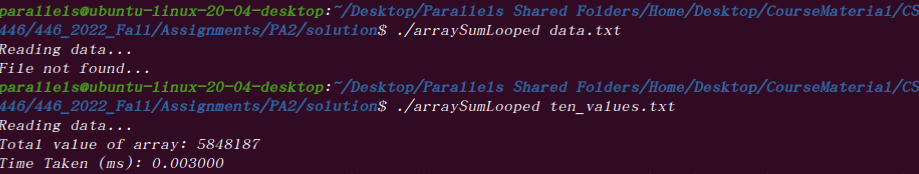
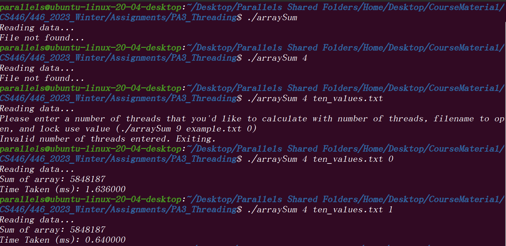
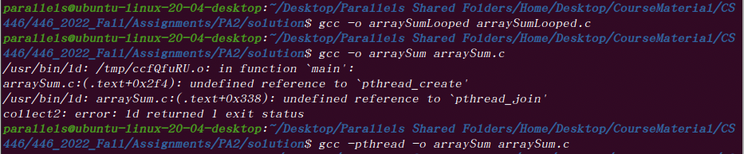

[](https://classroom.github.com/open-in-codespaces?assignment_repo_id=10754175)

**<p align = "center"> CS446-Spring23-PA3</p>**

**Learning Outcomes**
1. You will implement the general system thread API in C using the p_thread library. You will be able to describe how Unix implements general process execution of a child from a parent process.<br/>
2. You will compare varied thread count threaded output times to looped output times.<br/>

**General Instructions and Hints**: <br/>

-Name files exactly as described in the documentation below.<br/> 
-All output should match exactly what is in this document (including spacing, but excluding run times and the summation value without a lock!). If it does not match, it will not pass the autograder.<br/> 
-You are welcome to implement any functions in additions to the ones described here, as you see fit. <br/>
-When parts 1-3 are done, open a terminal and cd to your github repo, wherever you saved it. Do the following: _git add ._ then _git commit -m <whatevermessageyouwant>_ then _git push_.<br/>
-All work should be done on a machine where you have sudoer permission. <br/>
-You **must** use the pthread library to complete this assignment. Please use a system with linux installed (if you do not have one, they are available in the ecc) <br/>
-All work should be your own. <br/>
-Only turn in threadedSummation.c, loopedSummation.c, and responses.txt(no executables). <br/>
-You have been provided with tenValues.txt and oneThousandValues.txt. These files are there to use as data to test your code. Please note that you should be able to calculate the sum of up to 100000000 values, and that the data tested for your grade will be different.  <br/>
-The test data file can contain 1-100000000 values, so be sure to allocate enough space in your arrays to hold all integer values and only calculate sums for the utilized array indices. For example, if you only have 10 values in your file, your array should be large enough to hold the maximum number of values (100000000), but should only loop through the first ten to calculate the sum. (With such large arrays, you will want to make sure that any array created using the maxSize is statically allocated using the _static_ keyword- otherwise you will segfault)<br/>

 **Background** <br/>
 Normally, when you compile and run code using threads, the first thread is reserved for the main function, and subsequent threads are spooled up to split work among them. Similar to a stack, the last threads created should be the first threads exited. The OS is responsible for generating thread pools and spooling them. <br/>
 

The thread API requires each thread to:<br/>

1) Be created using pthread_create and passing the function that each thread should execute. <br/>
2) Exit by using pthread_exit after the function executes, as well as after all work is done in main. <br/>
3) Wait for all threads to execute before exiting main using pthread_join <br/>

In this assignment, you will write two programs. Each program will sum an array and calculate the milliseconds taken to fully execute the summation, and then output those values, though they will use different methods to calculate the sum so that threading (with and without locks) can be compared to not threading.  <br/>

**<p align = "center"> The Thread API, Part I</p>**
**General Directions** <br/>
 Name your first program _loopedSummation.c_.  In this part of the assignment, you will write a function called _readFile_ in the **C language**. Main() will parse your command line arguments ```(./loopedSummation data.txt)```,and check that 2 arguments have been entered (exe and data file to read from). If 2 arguments aren't supplied, main should tell the user that there aren't enough parameters, and then return 1. Otherwise, main should call _readFile_ which will read all data from the command line supplied file name.
 
 <br/>

The purpose of this portion of the assignment is to show you linux performance of a looped array sum as a baseline for comparison to the threaded version in part II.  <br/>


TLDR; I'm asking you to write code to read data from a file into an array, and then sum that array's data and output how long it took to sum.  <br/>

You may **only** use the following libraries for parts I and II: <br/>
 ```
stdlib  
stdio  
pthread
ctype  
string  
time  
```

_main_ <br/>
**Input Parameters**: int argc, char* argv[] (description of how to code command line arguments can be found [here]( https://www.tutorialspoint.com/cprogramming/c_command_line_arguments.htm)) <br/>
**Returned Output**: int <br/>
**Functionality**: main uses supplied command line arguments as parameters to a call to _readFile_. <br/>
Read from the file using your read method, an int array created in main, and the filename supplied on the command line by the user. <br/>  

The return from _readFile_ should be stored and if the method returns -1, main should return 1 for failure. Otherwise, a clock_t data structure should be used to store the time that summation starts at.  <br/>

Next, loop through the data array that was filled in readFile and calculate the array's sum. Then store the time the program finished in a clock_t variable and calculate the total time of execution.<br/>


Calculating total time of execution can be done by subtracting start time from end time and dividing by clocks per second. Don't forget to convert it to ms! [code](https://stackoverflow.com/questions/32411678/does-clock-t-calculate-the-time-of-all-threads-c-pthreads) <br/>

Finally, main should output the total value of the array and time taken to calculate it in ms. <br/>
 

_readFile_<br/>
**Input Parameters**: char[], int[] <br/>
**Returned Output**: int <br/>
**Functionality**: _readFile_ takes the supplied filename from the command line, creates an input stream, and opens it for reading. If the file is not found, this method should print "File not found..." and -1 should be returned. Otherwise, the entire file should be looped through using fscanf and the values from the file should be placed in the passed in integer array. This method should have a counter for the number of values in the file that is incremented each time fscanf is successful. Finally close the stream and return the number of values.   <br/>

All output for this program and its compilation is shown below.  </br>
**<p align = "center">  </p>**<br/>
 
 **<p align = "center"> The Thread API, Part II </p>**<br/>
Name your second program _threadedSummation.c_   . In this part, you will implement array summation using threading so that you can compare the performance of looped array summation (Part I) with threaded array summation (Part II) in Part III.  <br/>

The threading API is built into the pthread library, which is common across most Unix backended systems. While many people think that more threads leads to better performance, this isn't always the case.  <br/>  

 **Directions**

The code for this portion should be written in **C**. Your program should consist of 3 functions: main, summation, readFile, as well as a struct to hold thread information. Below, I provide the general description of each of the functions and the struct. <br/>

 You may only use the following libraries: <br/>
 ```
stdlib
stdio
pthread
ctype
string
time
```  
For this assignment, you may have _two_ global variables. One to store the sum of the array's values (which should be initialized to 0) and one to construct a global pthread_mutext_t object to be used in locking.  You will need to use the pthread man page to format your pthread commands so that they are syntactically correct. The man page for pthread can be found [here](https://man7.org/linux/man-pages/man7/pthreads.7.html).<br/>

_thread\_data_
**This is a struct. It can be defined in the threadedSummation.c file in the global space. The code for the data structure is supplied below.<br/>

```
typedef struct thread_data{
    int tid;
    int *data;
    int startInd;
    int endInd;
    int useLock; //add
}thread_data;
```

_main()_<br/>

From the terminal, the user should be able to enter the program name, number of threads they'd like to execute, the file that data should be read from, and if the user would like the data structure to be locked (1) or not locked (0). If the user chooses to lock, then you should initialize the mutex using pthread\_mutex\_init and the lock you created in the global space. The mutex lock should be destroyed at the end of the program using pthread\_mutex\_destroy. <br/>

So for example, input might look something like this: ```./threadedSummation 5 ten_values.txt 0 ```, or ```./threadedSummation 99 oneThousandValues 1``` <br/>

If the user does not enter the four arguments (program name, number of threads, file name, and lock status), then you should return 1 for failure and print the appropriate error message (shown below). If four arguments are provided, then read from the file using the command line supplied name.

If the program was able to open the file, construct an array of thread\_data structs. Then, use [atoi](https://www.tutorialspoint.com/c_standard_library/c_function_atoi.htm) to cast the number of threads from the command line from a string to an integer value and to cast the lock status from the commandline from a string to an integer. If they can't be cast, output "Please enter a number of threads that you'd like to calculate with, filename to open, and whether to lock (./threadedSummation 9 example.txt 0)" and return 1 to exit the program. Otherwise, check to see that the number of threads they've requested is less than the number of values that you've read in, so that you don't accidentally segfault later. If too many threads have been requested, output the error shown below and return 1.  <br/>

If an appropriate number of threads has been entered, construct an array of threads using pthread_t and the number of threads requested by the user on the command line. Create a  clock_t data structure and store the time that summation starts at by recording initializing the clock_t data structure with the time just before you pthread create. Initialize the mutex using pthread\_mutex\_init if the user has chosen to use a lock. <br/>

Next, loop through the array of thread\_data structs, and set the tid, end index and start index of the slice of the array you'd like the thread to sum, the user's useLock value (which should be cast using atoi), and the data elements of each struct. NOTE: the data array will be all of the read in data from earlier, and will be identical for each data struct. Start index and end index variables in the thread data struct are responsible for designating that thread's starting index to sum and ending index to sum- in other words, it defines the chunk of array indices that the thread is responsible for. Assuming you loop from 0 to number of threads, the thread data struct's end index should be calculated by  multiplying the current loop index plus one by the quotient of the maximum number of data elements and the number of threads minus 1. The thread data structs start index can be calculated subtracting the quotient of the maximum number of data elements and the number of threads and adding 1. Your last thread should contain any remainder array indices not used by earlier threads.<br/>

 Once the values are set for each thread, loop through the thread array using a **new** loop. For each thread, call pthread\_create and pass it the thread from the p_thread array at that index, the summation method, and your thread data struct that was previously set at the same index in the thread\_data array. After each thread has been created, use another **new** loop, and loop through each thread again, calling pthread\_join to make each thread pause until they've all completed.  Then store the time the program finished at in a clock_t variable and calculate the total time of execution. <br/>


Calculating total time of execution can be done by subtracting start time from end time and dividing by clocks per second. Don't forget to convert it to ms! [code](https://stackoverflow.com/questions/32411678/does-clock-t-calculate-the-time-of-all-threads-c-pthreads) <br/>

Finally, main should output the total value of the array and time taken to calculate it in ms. Destroy your mutex lock using pthread\_mutex\_destroy and end the main function's thread using pthread\_exit. <br/>


_readFile_<br/>
**Input Parameters**: char[], int[] <br/>
**Returned Output**: int <br/>
**Functionality**: _readFile_ in Part II behaves the same way as defined in Part I- you are welcome to copy paste from your looped program to your threaded program <br/>

All output for this program and its compilation is shown below.  </br>

_summation_<br/>
**Input Parameters**: void*, int <br/>
**Returned Output**: void* <br/>
**Functionality**: _summation_ takes a thread struct that has been passed by address, and creates a thread data ptr out of it. You will need to type cast the passed in void * to type * thread data struct. This method should then use the useLock property of the thread\_data struct to check if the user wants to use a lock. If they do, use the pthread\_mutex\_lock call on the global lock that you created- this should be done after you typecast, but before you do anything else in the function. Use the passed in thread\_data struct's start and end indices, and sum directly into global total variable that you created. For example, if the thread data struct has a start index of 0 and an end index of 5, that thread should only sum indices 0-5 into the local variable from the array of data that you passed in as an argument, not the entire array, and it should always add to the global variable. Once the appropriate array slice has been summed, unlock the mutex if a lock was used using the pthread\_mutex\_unlock command. NOTE: the global variable should both be of type long long int.<br/>

All output for this program and its compilation is shown below. Note that the run times will change each time you run the program, whether you use a lock or not. Additionally, you **should** notice that the sum of the array without a lock changes if you have set the mutex up in the right spot and summed directly into the global sum. <br/> </br>

**<p align = "center"> </p>**<br/>

**Part 2 Requirements and Hints**: 

Part 2 should be done in c using pthread. <br/>
Note that the test data file for grading will be different than the supplied data files. Make sure you test a few different scenarios to ensure your programs are working right. <br/>
Note that you will need to use an additional pthread flag when you compile this program, otherwise you will encounter an error. See below.<br/>


 **<p align = "center"> </p>**<br/>

 **<p align = "center"> The Thread API, Part III </p>**<br/>
 There is a file in the repo called "responses.txt". Add your name to the file (first line) and then answer each question.

 **To Submit**<br/>
 When you are done, you should use git to git push the following to your assignment repo (see instructions above):
 1) _threadedSummation_.c_
 2) _loopedSummation.c_
 3) _responses.txt_

You can submit as many times as you would like, and you can check whether your code is functioning correctly using the autograder. 

**Do not forget to submit you repo link to webcampus, even if it's late. We use your github timestamp to determine late submission, not your webcampus timestamp**
